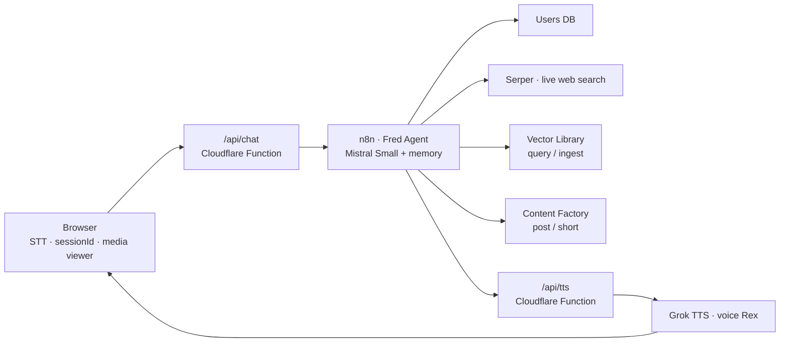

# 🎙️ FRED AI

**A voice-first AI agent front-end** — talk to an AI that listens, thinks, searches your media library, and talks back in a voice with personality.

**W57TH · Voice Intelligence · New York**

FRED is the front-facing voice of the West57th content operation. He's a sharp, 1980s Madison Avenue ad-man (dry wit, scotch-at-3pm energy, lives in Peoria, IL) who happens to be the gatekeeper of a fully automated content factory — and you reach him by just... talking.

> **Stack at a glance:** Static HTML/CSS/JS → Cloudflare Pages Functions (edge proxies) → n8n AI Agent (Mistral) → Grok TTS. Zero servers to manage.

---

## What It Does

A complete voice loop runs in the browser with no app install:

1. **You speak** — speech-to-text runs locally in the browser via the Web Speech API (near-instant, no transcription server lag).
2. **Fred thinks** — your words go through a Cloudflare proxy to an n8n AI Agent (Mistral Small) with persistent Postgres memory, live web search, a user database, and a semantic media library.
3. **Fred talks back** — his reply is rendered as expressive speech by Grok TTS (voice: **Rex**, MP3 24 kHz) with a browser speech-synthesis fallback if the stream drops.

Every conversation is tied to a persistent `sessionId` stored in `localStorage` — so Fred knows who's talking, remembers context across sessions (20-turn window), and can recognize the same person on a new device via their phone number.



---

## The 6 Tools Fred Can Use

| Tool | What it does |
|---|---|
| **Users DB** | Reads/writes the Postgres `users` table by `session_id` or phone; merges multi-device profiles via `ON CONFLICT (phone)`. |
| **Serper** | Live Google search for news, trends, and research — with time filters ("this week", "last month"). |
| **Vector Ingest** | Uploads a hosted folder of images/PDFs/video links into a semantic media library. |
| **Vector Query** | Finds specific media by description ("the b-roll from the July shoot") and returns ranked file URLs. |
| **Submit Short** | Routes a verified short-form video URL to the editing microservice → captions, thumbnails, tags → published across 6 social networks. |
| **Submit Post** | Takes a conversational content brief (topic, body, mentions, hashtags, URLs, media) → production factory → custom background track, AI visual, text overlays → published across 6 social networks. |

Fred detects intent conversationally: **upload** vs. **search** vs. **post a short** vs. **publish a post** vs. plain chat — always confirming before any tool fires, and never reading URLs aloud (the front-end parses and displays media results visually instead).

---

## 🚀 Real Use Cases

This isn't a toy chatbot — it's a hands-free operator for real work. Here's what it's genuinely good at:

### 🎬 Content Operations Copilot
A social media manager on set or in the edit bay, hands busy: *"Fred, post the new teaser to all platforms"* or *"submit the July recap as a short."* Fred confirms the brief, verifies the phone number on file, and the production factory handles music, visuals, captions, and distribution to **6 social networks**. One sentence = a fully published post.

### 📼 Media Library Oracle
For teams with thousands of images, PDFs, and video clips scattered across folders: *"Find the drone shots from the LA shoot last spring."* Fred runs a semantic vector query and returns the ranked results — displayed as a visual grid in the chat, opened full-size on click, video playable inline, PDFs linked out. No more hunting through OneDrive folders by filename.

### 🏢 Voice-Powered Client Intake & CRM
An agency principal talking to a client on the phone can dictate a brief in real time: *"Fred, take a post: topic is the product launch, mention @partner, tag it under launches."* Fred collects the fields conversationally, stores the client's profile (name, phone, email), and routes the brief to production — with WhatsApp updates on delivery.

### 🎧 Hands-Free Environment Assistant
Studio floors, warehouses, workshops, kitchens, live desks — anywhere keyboards are impractical: a voice agent that answers questions from a company knowledge base, takes requests, and acts on them, all without touching a screen. The browser-local STT means it responds instantly, and it works on any device with a browser.

### 📱 Cross-Device Personal Assistant
Start on your phone, finish on your desktop — Fred merges the session by phone number, remembers your name, your posts, and your history. One identity across every device you talk to him from.

### ♿ Accessibility-First Voice UI
Pure voice-in/voice-out with no app, no install, no login screen. A compelling baseline for vision- or mobility-impaired users, kiosks, and elderly-friendly interfaces — the entire interaction model is speech.

### 🧪 Proof-of-Concept Platform
A minimal, readable template (one HTML file, one CSS file, two tiny edge functions) demonstrating the full modern pattern: **static front-end → serverless proxies → AI agent with tools → expressive TTS**. Swap n8n for any backend and it still works.

---

## 🔐 Security Model

No secrets ever reach the browser:

- **Grok API key** — lives only in Cloudflare **Variables and Secrets** (`GROK_API_KEY`), injected server-side into a Pages Function that proxies `/api/tts` to xAI.
- **n8n webhook key** — lives in Cloudflare **Variables and Secrets** (`X_Fred_Key`), injected server-side into a Pages Function that proxies `/api/chat` and adds the `X-Fred-Key` header.
- **n8n webhook** (`POST /fred`) is protected by **Header Auth** — requests without the key are rejected.
- **User data** — session identity and contacts are server-side in Postgres; the browser only holds an opaque session ID.
- Result: the public repo contains zero credentials, and the API keys rotate in the dashboard without touching code.

---

## 📦 Project Structure

```
fred-ai/
├── public/                 ← the static site (Cloudflare output dir)
│   ├── index.html          ← the entire app (STT, chat, TTS, media viewer)
│   ├── style.css           ← dark UI theme
│   ├── logo.png
│   └── bg.png
├── functions/              ← Cloudflare Pages Functions (edge, server-side)
│   └── api/
│       ├── chat.js         ← proxies chat to n8n, injects X-Fred-Key header
│       └── tts.js          ← proxies TTS to Grok, injects GROK_API_KEY
└── README.md
```

---

## ⚡ Deployment

### Cloudflare Pages (front-end)

1. Create a new Pages project → **Connect to Git** → this repo (`main` branch).
2. Build command: **none** · Output directory: **`public`**.
3. **Settings → Variables and Secrets → Add** (both as *Encrypt*):
   - `GROK_API_KEY` — your xAI API key
   - `X_Fred_Key` — the exact value configured in the n8n webhook below
4. Deploy. Every push to `main` auto-deploys.

### n8n (agent backend)

The companion workflow (`* 🎙️Fred Voice`) exposes a webhook at `POST /fred`:

1. **Webhook node** — set Authentication to **Header Auth**:
   - Header name: `X-Fred-Key`
   - Header value: a strong shared secret (same value as the Cloudflare secret)
2. **Database** — a Postgres (or Supabase) `users` table with columns `id`, `session_id`, `phone`, `email`, `name`, `first_login`, `last_login`, `posts`, `last_execution_id` — with a **unique constraint on `phone`** (used to merge multi-device sessions).
3. **Credentials** — Mistral Cloud (model: `mistral-small-latest`), Serper search API, and the n8n webhook links for the vector library and content factory.
4. Publish the workflow (production executions run the **published** version).

### Configuration in `public/index.html`

The `CFG` block at the top of the file holds non-secret knobs: voice (`VOICE_ID`), audio codec/sample rate/bit rate, language, and the API paths (`/api/chat`, `/api/tts`) — no keys, by design.

---

## 🛠️ Tech Stack

| Layer | Technology |
|---|---|
| Front-end | Vanilla HTML/CSS/JS (single file app), Web Speech API (STT), Canvas-free animated UI |
| Edge | Cloudflare Pages + Pages Functions (Workers runtime) |
| Agent | n8n · AI Agent node (LangChain), Mistral Small |
| Memory | Postgres chat memory (20-turn window, per session) |
| Tools | Postgres tool, Serper, vector library webhooks, content factory webhooks |
| Voice | Grok TTS (voice `Rex`, MP3 24 kHz) + SpeechSynthesis fallback |
| Deployment | GitHub → Cloudflare Pages auto-deploy |

---

## 📌 Notes

- Prior versions of the app live in the local git history (v1.9.x and earlier); this repo starts fresh at **v1.10.0** with the server-side secrets migration.
- The UI is fully keyboard-accessible as a fallback (toggle next to the mic), so it works even without voice permissions.

---

*FRED AI — built on the West57th content platform · dev@w57th.agency*
